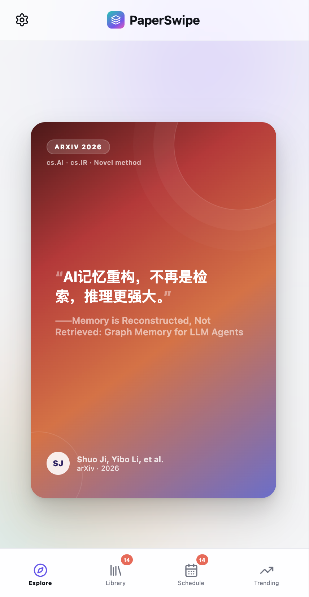
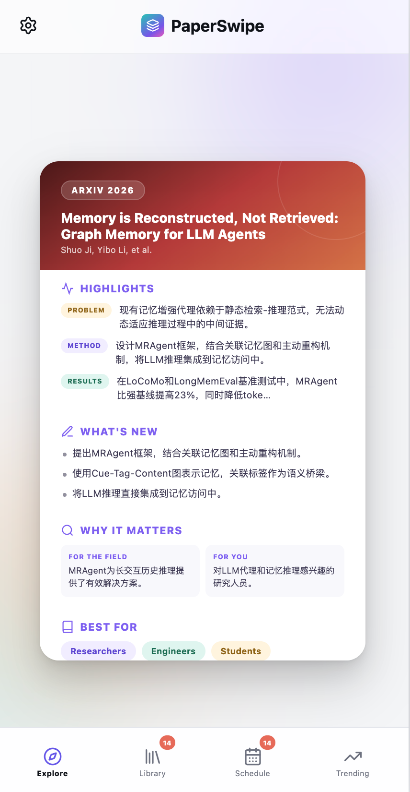
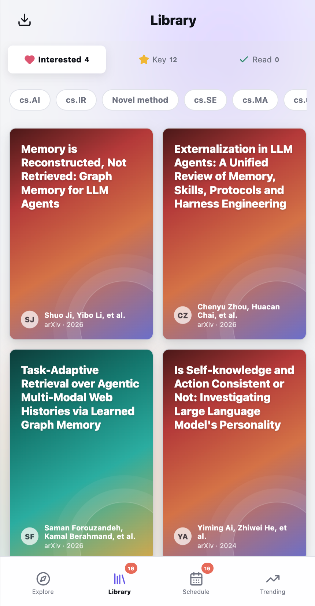
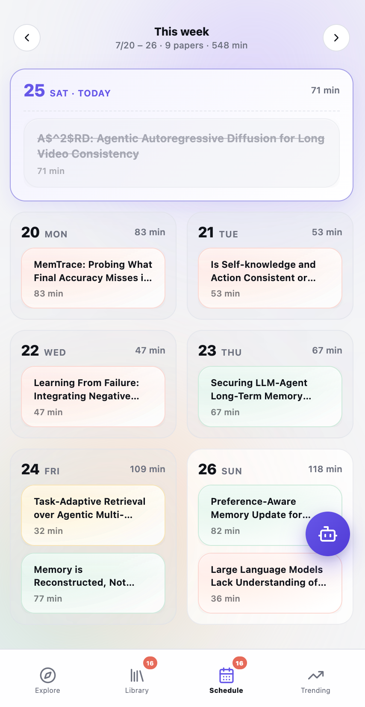
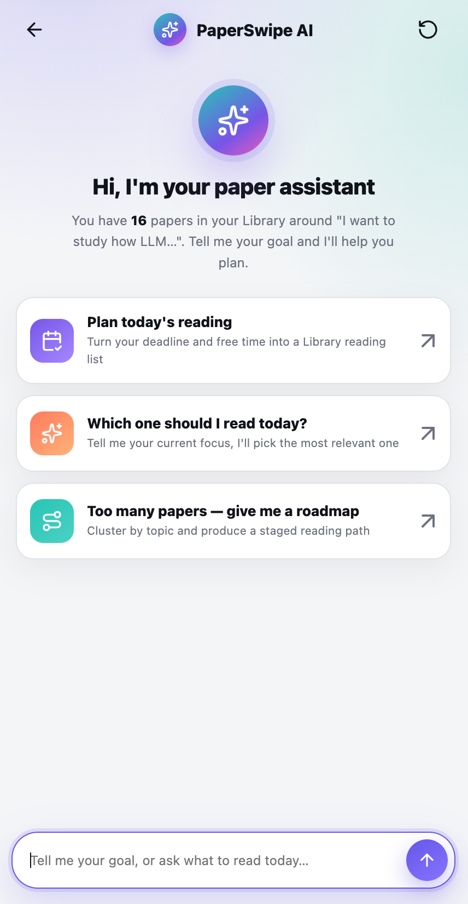
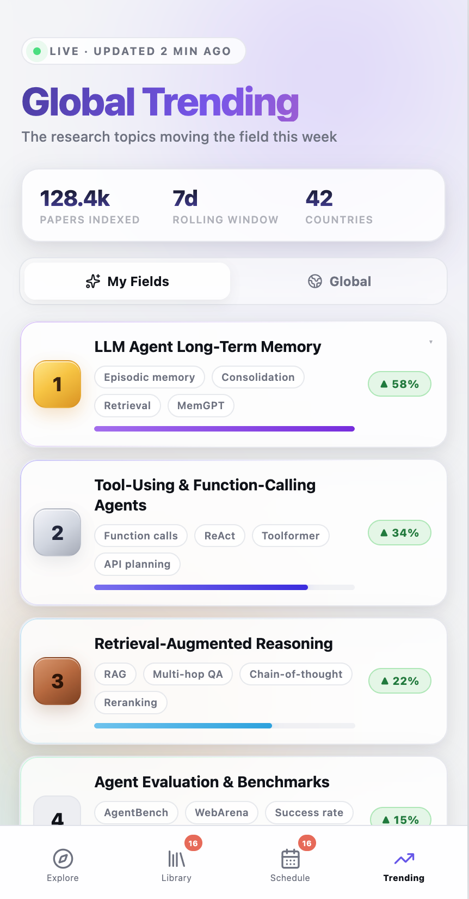

# PaperSwipe

**别再只收藏论文了，把值得读的论文筛出来。**

PaperSwipe 是一个手机优先的论文发现与阅读整理 H5 应用。你可以用自然语言描述研究兴趣，检索开放论文库，通过摘要卡片了解研究问题、方法和贡献，再用四向滑动完成取舍，将论文整理进自己的 Library。

项目采用 **Go 后端 + 原生 HTML / CSS / JavaScript 前端**，无需前端构建工具，也不需要数据库。文本模型和图片模型均为可选配置：没有模型密钥时，仍可使用论文检索、本地摘要、收藏和导出等基础功能。

> **当前版本定位：可运行的产品原型 / MVP。** 检索、摘要、收藏和文献导出已有实际实现；Trending、部分卡片指标和学习路线包含演示数据，日程与助手也有明确的实现边界。本文以当前代码为准，详见[功能状态与已知限制](#limitations)。

## 目录

- [产品概览](#overview)
- [快速开始](#quick-start)
- [使用指南](#usage)
- [配置说明](#configuration)
- [工作原理](#architecture)
- [数据存储与备份](#storage)
- [HTTP API](#api)
- [开发、测试与构建](#development)
- [部署说明](#deployment)
- [项目结构](#structure)
- [功能状态与已知限制](#limitations)
- [常见问题](#faq)
- [许可证与第三方资源](#license)

<a id="overview"></a>

## 产品概览

### 从研究兴趣到阅读清单

```text
描述研究兴趣
    ↓
生成检索关键词 → 依次尝试开放论文源
    ↓
本地摘要 / 可选 LLM 摘要 → 分批返回论文卡片
    ↓
Explore：跳过 / 感兴趣 / 重点 / 已读
    ↓
Library：分类、查找、查看详情、导出
    ↓
Schedule 与阅读助手：辅助安排阅读
```

### 主要模块

| 模块 | 主要用途 | 当前实现 |
| --- | --- | --- |
| Initialize | 设置身份、研究兴趣、发现风格与阅读难度 | 三步引导；研究兴趣可经 LLM 或本地规则转为检索词 |
| Explore | 浏览论文、翻转卡片、四向滑动决策 | 开放论文检索、结构化摘要、原文/PDF 链接、收藏状态写入 |
| Library | 管理感兴趣、重点和已读论文 | 分类、主题筛选、文本搜索、详情卡片、移除、多选导出 |
| Schedule | 查看一周阅读安排 | 根据 Library 生成周视图，支持选择日期、优先级及会话内完成标记 |
| PaperSwipe AI | 辅助选择与规划阅读 | 本地规则生成每日安排、周计划、今日推荐；学习路线使用预置数据 |
| Trending | 浏览研究热点与示例论文 | 预置的 My Fields / Global 榜单与部分主题详情 |
| Settings | 修改研究主题、外观和 Zotero 配置 | Light / System / Dark；重启引导；保存浏览器侧配置 |

适合希望快速筛选相关文献的研究生、博士生、研究者，以及希望通过简短卡片了解研究工作的技术爱好者。卡片用于初筛，研究结论仍应回到原文核验。

### 界面预览

以下图片来自仓库内的产品展示素材，具体布局以运行版本为准。

| Explore：卡片正面 | Explore：卡片背面 | Library：文献库 |
| :---: | :---: | :---: |
|  |  |  |

| Schedule：阅读日程 | PaperSwipe AI：阅读助手 | Trending：趋势展示 |
| :---: | :---: | :---: |
|  |  |  |

仓库还提供[初始化演示视频](introweb/videos/initialize.mp4)与[滑动筛选演示视频](introweb/videos/explore-swipe.mp4)。

<a id="quick-start"></a>

## 快速开始

### 环境要求

- **Go 1.24 或更高版本**，以 `go.mod` 声明为准。
- 支持 JavaScript、`fetch` 流式响应、Pointer Events 和 `<dialog>` 的现代浏览器。
- 检索真实论文需要后端能够访问至少一个开放论文源。
- 使用 LLM、图片生成或 Zotero 导出时，需要相应服务的有效配置及网络连接。

Go 模块当前仅使用标准库，没有第三方 Go 模块依赖。运行主应用不需要 Node.js、npm、Python、Redis 或数据库。

### 直接运行

在项目根目录执行：

```bash
go run .
```

Windows PowerShell 示例：

```powershell
Set-Location 'C:\Users\Administrator\Documents\GitHub\PaperSwipe'
go run .
```

打开 **[http://localhost:8080](http://localhost:8080)**，完成三步初始化即可进入应用。停止服务时，在运行它的终端按 `Ctrl+C`。

首次体验不必配置模型密钥。无密钥时，主题拆解和论文摘要使用本地规则；检索真实论文仍需要网络。程序会读取当前工作目录的 `.env.local`，因此已有本地配置或系统环境变量时，可能自动启用模型服务。

> 仓库当前包含已跟踪的 `data/state.json`，运行后可能看到已有的收藏与检索历史。需要独立的数据空间时，将 `DATA_DIR` 指向新的目录；无需删除仓库中的数据。

例如，在 PowerShell 中使用独立数据目录，并只允许本机访问：

```powershell
$env:ADDR = '127.0.0.1:8080'
$env:DATA_DIR = Join-Path $env:LOCALAPPDATA 'PaperSwipe\data'
go run .
```

### 检查服务是否启动

浏览器访问 [http://localhost:8080/api/health](http://localhost:8080/api/health)，或执行：

```powershell
Invoke-RestMethod 'http://localhost:8080/api/health'
```

`ok: true` 说明本地 HTTP 服务可以响应。`ai_enabled` 和 `image_enabled` 反映配置是否满足启用条件，**不会验证密钥、额度或上游服务是否实际可用**。

<a id="usage"></a>

## 使用指南

### 1. 初始化研究兴趣

首次打开应用时依次完成：

1. **选择身份**：Graduate / PhD、Professor / Researcher 或 Explorer。
2. **描述研究兴趣**：输入 6～360 个字符，点击 `Analyze & Continue`。
3. **设置发现风格**：选择 `Stay Focused` 或 `Explore More`，并设置阅读难度或额外感兴趣的主题，点击 `Get Started`。

研究兴趣可以写成完整的问题，例如：

> 我想研究 LLM Agent 如何形成、检索并更新长期记忆，以及这些机制对复杂任务表现的影响。

系统将描述转换成检索字符串和至多 6 个关键词。配置文本模型后优先调用模型；未配置、调用失败或结果不可用时回退到本地概念匹配与英文关键词提取。

身份、发现风格、阅读难度及好奇主题会保存在浏览器中。**当前搜索请求只传递检索词和结果数量，这些偏好尚未完整接入后端排序或摘要深度控制。**

### 2. 在 Explore 中筛选论文

卡片正面提供论文标题、作者及一句话概述；点击卡片可翻到背面，查看问题、方法、结果、创新点和阅读建议等信息。原文与 PDF 链接取决于数据源是否提供。

| 操作 | 视觉标记 | 含义 | 后端 `action` | Library 分类 |
| --- | --- | --- | --- | --- |
| 左滑 / `←` | NOPE | 跳过 | `dismiss` | 不显示在 Library |
| 右滑 / `→` | YES | 感兴趣，保留待看 | `save` | Interested |
| 上滑 / `↑` | TOP | 标记重点 | `priority` | Key |
| 下滑 / `↓` | DONE | 标记已读 | `read` | Read |
| 点击卡片 / 空格键 | 翻转 | 切换卡片正反面 | 无 | 不改变分类 |

方向键和空格键用于 Explore；输入框聚焦、弹窗打开或加载等状态下，快捷键会被限制。触屏设备支持手势，桌面可用鼠标拖动。

同一个论文 ID 只保存**最新状态**。例如，对同一篇论文先右滑再上滑，它会从 Interested 移到 Key，不会同时出现在两个分类中。当前没有操作历史列表或撤销接口，也没有根据历史操作自动过滤后续搜索结果的机制。

### 3. 在 Library 中整理文献

- 使用 **Interested / Key / Read** 标签切换分类。
- 用主题标签筛选当前分类中的论文；同时选择多个标签时，匹配任一标签即可保留。
- 搜索框支持在标题、作者、摘要及发表场所中进行文本匹配。
- 点击卡片查看详情、翻面及访问原文。
- 长按卡片可移除论文，或选择日期与优先级加入阅读日程。
- 默认按最近更新时间展示。代码保留了按引用数、阅读时长排序的分支，但当前页面没有对应的可见排序控件。

“删除”实际向后端写入 `dismiss`，论文将退出 Library，但仍保留在后端状态中，并计入跳过数量。

#### 导出 BibTeX

点击 Library 的导出按钮进入多选模式，选择论文，再点击 `BibTeX`，浏览器会下载：

```text
paperswipe-YYYY-MM-DD.bib
```

导出在浏览器本地完成。条目包含可用的标题、作者、年份、发表场所、链接及 PaperSwipe 备注；引用类型依据发表场所名称推断。

当前导出存在两点需要核对：

- 后端 DOI 位于 `external_ids.DOI`，而导出代码读取 `paper.doi`；BibTeX 与 Zotero 条目可能遗漏 DOI。
- BibTeX 的摘要读取 `digest.tldr`，而当前摘要模型未定义该字段，因此通常不会导出摘要。

全选逻辑按分类与主题标签取值，**尚未叠加搜索框的文本过滤**。导出前请核对选中数量与条目；正式写作前也应检查作者、发表类型与 DOI。

#### 导入 Zotero

1. 在 Zotero 账户中准备可访问并写入个人文献库的 API Key，以及对应的数字 User ID。
2. 在 PaperSwipe 的 `Settings → Zotero` 中填写两项信息。
3. 点击 `Test connection`，检查基本读取连接。
4. 回到 Library，选择论文并点击 `Zotero`。

前端直接调用 Zotero API，按每批最多 50 篇写入个人文献库，并报告成功或失败数量。连接测试仅发起读取请求；测试成功并不代表一定具有写入权限。

当前功能属于**单向创建条目**：没有双向同步、自动去重、集合选择、群组文献库支持或 PDF 附件上传。重复导入可能产生重复条目。

Zotero API Key 和 User ID 保存在当前站点的浏览器 `localStorage` 中，点击 `Clear` 可清除。它们与只在 Go 后端使用的文本/图片模型密钥采用不同的保存方式。

### 4. 使用 Schedule 安排阅读

Schedule 从 Library 中的 Interested 和 Key 论文生成周视图，支持切换周、查看论文、标记完成和移除。Library 长按菜单可指定日期以及 High / Medium / Low 优先级。

当前日程属于浏览器侧的原型实现：

- 日期、优先级和完成标记保存在页面内存中，刷新或关闭页面后会丢失。
- 勾选日程完成只改变会话内标记，**不会将论文改为 Library 的 Read 状态**。
- 从日程移除论文会调用 Library 移除逻辑，持久化为 `dismiss`。
- 自动安排根据论文 ID 和周日期生成布局；同一论文可能出现在不同周，不能把它视为已持久化的长期日程。

### 5. 使用阅读助手

在 Schedule 中点击机器人按钮打开 `PaperSwipe AI`。先向 Library 保存一些论文，再尝试输入：

```text
我每天有 45 分钟，请为我排一周阅读计划。
今天最应该读哪一篇？
请按每天 60 分钟、截止 2026-10-01，为我规划阅读。
帮我整理从综述到经典再到最新工作的学习路线。
我的 Library 主要有哪些研究主题？
```

助手通过关键词规则识别意图，结合 Library 中的相关性、阅读时长等字段生成每日安排、周计划或推荐卡片。默认周计划为 7 天；识别到截止日期时，规划范围限制在 3～14 天，每日预算限制在 15～240 分钟，放不下的论文会列为未排入项目。

周计划支持下载 `.ics` 文件。当前按每个有阅读任务的日期生成一个日历事件，开始时间设为浏览器本地时间 20:00，时长为当日累计阅读分钟数。文件没有显式时区定义，导入后应核对时间。

**助手回复不调用聊天模型。** Roadmap 读取 `web/mockdata/roadmap.js` 中的固定示例，也不会自动把对话中的计划写回 Schedule。`.ics` 是文件导出，不是日历账户同步。

### 6. 浏览 Trending 与修改设置

Trending 提供 `My Fields` 和 `Global` 两种榜单展示，以及预置主题的论文卡片交互。当前榜单、热度、增长比例和“LIVE”文案均来自静态数据，`My Fields` 也不是依据个人画像实时计算的榜单。

Settings 支持修改研究主题、切换外观和保存发现偏好。更新主题会重新检索；`Restart setup` 清除浏览器中的初始化资料并重新打开引导，**不会清空后端 Library**。也可通过 `/?onboarding=1` 强制显示引导。

<a id="configuration"></a>

## 配置说明

### 配置加载规则

程序启动时读取**当前工作目录**下的 `.env.local`，而不是自动定位可执行文件所在目录。

```text
已存在的进程环境变量 > .env.local > 代码默认值
```

已有环境变量即使为空，也不会被 `.env.local` 覆盖；后续取值逻辑仍可能把空字符串视为未配置并采用默认值或其他密钥。修改配置后需要重启 Go 服务。

配置解析器支持 `KEY=value`、单引号/双引号包裹的值、空行、整行 `#` 注释，以及可选的 `export ` 前缀。它不是完整的 dotenv 解析器，不支持变量插值或多行值；不要把行尾注释写在值后面。程序不会自动加载 `.env` 或 `.env.example`。

### 环境变量一览

| 变量 | 默认值 / 回退规则 | 说明 |
| --- | --- | --- |
| `ADDR` | `:8080` | HTTP 监听地址；仅本机使用可设为 `127.0.0.1:8080` |
| `DATA_DIR` | `data` | 状态目录，状态文件为该目录下的 `state.json` |
| `DEV` | 未设置 | 仅值为 `1` 时从磁盘读取 `web/`，并关闭静态资源缓存 |
| `SEMANTIC_SCHOLAR_API_KEY` | 空 | Semantic Scholar 请求头中的 `x-api-key` |
| `ZHIPU_API_KEY` | 空 | 文本和图片服务可回退使用的共享密钥 |
| `LLM_API_KEY` | 回退到 `ZHIPU_API_KEY` | 文本模型密钥 |
| `LLM_BASE_URL` | `https://api.openai.com/v1` | 文本 API 基础地址，程序追加 `/chat/completions` |
| `LLM_MODEL` | `gpt-4.1-mini` | 文本模型名称 |
| `LLM_THINKING` | 空 | 仅 `enabled` / `disabled` 会转成 `thinking.type` 请求字段 |
| `LLM_REASONING_EFFORT` | 空 | 非空时作为 `reasoning_effort` 传入上游 |
| `LLM_MAX_TOKENS` | 不传入 | 配置为正整数时，作为 `max_tokens` 传入上游 |
| `IMAGE_API_KEY` | 依次回退到 `ZHIPU_API_KEY`、`LLM_API_KEY` | 图片模型密钥 |
| `IMAGE_BASE_URL` | 回退到 `LLM_BASE_URL`，再到 `https://api.openai.com/v1` | 图片 API 基础地址，程序追加 `/images/generations` |
| `IMAGE_MODEL` | 空 | 图片模型名称；为空时关闭图片生成 |
| `IMAGE_SIZE` | `1280x1280` | 图片尺寸，直接传给上游 |

不同服务的密钥、基础地址与模型需要配套设置。**只填写 `ZHIPU_API_KEY` 不会自动切换基础地址到智谱**；如果未设置 `LLM_BASE_URL`，仍会使用代码中的默认地址。

### 示例：智谱文本模型与可选图片模型

在项目根目录创建 `.env.local`，按需填写以下内容。`YOUR_OWN_ZHIPU_API_KEY` 必须替换为你自己的密钥：

```dotenv
ZHIPU_API_KEY=YOUR_OWN_ZHIPU_API_KEY

LLM_BASE_URL=https://open.bigmodel.cn/api/paas/v4
LLM_MODEL=glm-4.5-air
LLM_THINKING=disabled

IMAGE_BASE_URL=https://open.bigmodel.cn/api/paas/v4
IMAGE_MODEL=glm-image
IMAGE_SIZE=1280x1280
```

以上模型名沿用仓库中的配置示例，不表示对服务当前可用性、账户权限或额度的保证。若只需要文本摘要，可省略或清空 `IMAGE_MODEL`。

仓库提供 `.env.example`，但其当前密钥字段含有非空值；不要把它当作可共享的有效凭据，也不要直接沿用。请使用自己的密钥。`.env.local` 和 `.env` 已被 `.gitignore` 排除，`.env.example` 仍是已跟踪文件。

### 示例：其他兼容文本服务

```dotenv
LLM_API_KEY=YOUR_OWN_LLM_API_KEY
LLM_BASE_URL=https://your-provider.example/v1
LLM_MODEL=YOUR_MODEL_NAME

IMAGE_MODEL=
```

`your-provider.example` 是占位地址，必须替换为服务的真实基础地址。程序发送 Chat Completions 风格请求，使用 `messages`、`temperature`、`response_format: {"type":"json_object"}`，并读取 `choices[0].message.content` 中的 JSON。

兼容性取决于上游是否接受这些字段。思考模式、推理强度与 token 上限均按配置直接传递；服务不支持时应取消相应配置。基础地址不要重复包含 `/chat/completions`。

### 如何关闭模型调用

- 关闭文本模型：清除 `LLM_API_KEY` 和 `ZHIPU_API_KEY` 的有效值。
- 关闭图片模型：清空 `IMAGE_MODEL` 即可，即使其他密钥仍存在。
- 检查系统环境变量，避免 `.env.local` 中的修改被更高优先级配置覆盖。

文本模型在初始化主题拆解和搜索摘要时可能产生调用；后端不会在每次搜索时自动生成图片。

<a id="architecture"></a>

## 工作原理

### 论文检索：按顺序降级

后端按以下顺序尝试论文源：

```text
Semantic Scholar（最多 8 秒）
          ↓ 失败或无结果
arXiv（最多 8 秒）
          ↓ 失败或无结果
OpenAlex（最多 10 秒）
```

整个检索阶段有 28 秒上下文限制。某个源返回有效论文后即结束检索，**不会聚合三个源的结果，也不会为了补足数量继续请求下一源**。

| 数据源 | 代码中的检索方式 | 处理要点 |
| --- | --- | --- |
| Semantic Scholar | Paper Search API | 请求标题、摘要、作者、年份、引用及开放 PDF 等字段；过滤缺少标题/摘要的条目，并按标准化标题去重 |
| arXiv | Atom API | 把查询拆成 `all:词项`，使用 `OR` 连接，按 relevance 请求；解析作者、分类和 PDF 链接 |
| OpenAlex | Works API | 使用 `title_and_abstract.search` 与 `has_abstract:true`；还原倒排摘要，并提取开放访问位置 |

结果数量是期望上限，可能因源返回不足、过滤或去重而少于 `limit`。arXiv 查询使用 `OR`，因此降级后结果可能更宽泛。排序主要依据关键词覆盖、源内排名、引用量和近年加分；`match_score` 是启发式分数，不是统计概率或模型置信度。

### 摘要：本地兜底与可选 LLM

每篇论文先生成本地启发式摘要。它从已有摘要中选取问题、方法、结果及贡献相关句子，并补充阅读建议；不下载或解析 PDF 全文。

配置文本模型后：

1. 每批最多处理 **3 篇**，最多 **3 批并发**。
2. 将研究方向、论文 ID、标题和摘要发送给模型。
3. 提示词要求卡片正面 `hook` 使用简体中文，其余结构化摘要字段主要使用英文。
4. 按论文 ID 匹配返回结果；可用的模型摘要覆盖本地摘要。
5. 单批失败或某篇结果不符合应用条件时，保留本地摘要。
6. 按原始论文顺序发送各批结果；后完成的早期批次会阻塞后续批次的展示顺序。

摘要阶段有 300 秒上下文限制。流式指“**按批返回论文卡片**”，不是模型逐 token 输出。未启用 LLM 时，后端直接返回带本地摘要的整组论文。

### 图片生成：独立、按需、内存缓存

`POST /api/paper-image` 根据论文标题和摘要生成编辑插画。后端只有在密钥和 `IMAGE_MODEL` 均非空时启用此能力。

- 请求上游 `/images/generations`，携带 `model`、`prompt`、`size` 和 `watermark_enabled: true`。
- 只接受上游返回的 HTTPS 图片 URL，不处理仅返回 Base64 的响应。
- 使用论文 ID 作为缓存键；无 ID 时使用标准化标题。
- 缓存仅保存于 Go 进程内存，重启后失效；同一 ID 的内容变化不会自动更新缓存。
- 图片使用远程地址，项目没有自动下载图片或持久化图片文件。

前端保留了生图处理函数，但当前卡片模板未提供可见的生成按钮。因此此项应按**后端接口能力**理解，不应假定界面中已有可直接操作的一键生图入口。

### 所有论文源都不可用时

后端仍以 SSE 返回 `meta` 和 `done`，其中 `total` 为 `0`、`warning` 提示论文源不可用。浏览器发现最终没有论文时，会填充 Reflexion、Self-RAG、MemGPT 三篇内置参考论文。

这些条目不按本次查询重新筛选，界面当前会清除相关警告，也没有明确的离线示例标签。**看到卡片不代表本次检索成功**；确认来源时，应检查 SSE 的 `meta` 事件和服务日志。

<a id="storage"></a>

## 数据存储与备份

### 数据保存在哪里

| 数据 | 保存位置 | 重启 / 刷新后的行为 |
| --- | --- | --- |
| 收藏、重点、已读与跳过记录 | `${DATA_DIR}/state.json` | 后端重启后恢复 |
| 论文元数据与当时保存的摘要 | 每条 action 中的完整 `paper` | 随状态文件保存 |
| 最近检索词 | `state.json` 的 `recent_searches` | 最多 8 条，大小写不敏感去重，最近使用置顶 |
| 身份、研究意图、主题、发现风格、难度 | `localStorage`：`paperswipe-onboarding-v1` | 同一浏览器、同一站点来源下保留 |
| 外观主题 | `localStorage`：`paperswipe-appearance-v1` | 同上 |
| Zotero API Key 与 User ID | `localStorage`：`paperswipe_zotero_v1` | 同上；可在 Settings 清除 |
| 日程日期、优先级、完成标记 | JavaScript 内存 | 刷新后丢失 |
| 当前论文队列、助手对话与对话周计划 | JavaScript / 页面内存 | 刷新后丢失 |
| 生成图片 URL 缓存 | Go 进程内存；前端另有页面内缓存 | 重启后端 / 刷新前端分别清除 |

后端状态结构示意：

```json
{
  "version": 1,
  "actions": {},
  "recent_searches": []
}
```

`actions` 以论文 ID 为键，值包含 `paper`、`action`、`updated_at`。计数统计的是每种**当前状态的论文数量**，不是累计滑动次数。搜索结果不会整体持久化；只有提交 action 时，其论文信息才写入状态文件。

### 写入与共享范围

Store 使用进程内读写锁，在同目录写临时文件、同步并关闭后，通过重命名替换 `state.json`。每次保存会重写整个状态文件，适合当前轻量单实例场景；没有跨进程文件锁，不应让多个服务进程共同写入同一份文件。

应用没有登录、账号或用户隔离。同一后端实例上的所有客户端共享 Library 和检索历史，但各自浏览器的偏好与日程内存并不共享，也没有跨客户端实时推送更新。

### 备份与恢复

- 备份：停止服务后复制 `${DATA_DIR}/state.json` 到备份位置。
- 恢复：停止服务后，把有效的备份放回同一路径，再启动服务。
- 独立试用：设置新的 `DATA_DIR`，保留原有数据。
- 状态文件缺失时会使用空状态；文件损坏或内容不是可解析 JSON 时，启动会失败并记录 `open state store` 错误。
- 仓库中的 `data/state.json.bak.2026-07-25` 是已有备份文件；程序没有定时备份或自动选择该文件恢复的逻辑。

`localhost`、`127.0.0.1`、局域网 IP、不同端口或协议属于不同浏览器来源，因此对应的 `localStorage` 相互独立。

### 数据与密钥的流向

论文源接收检索词；启用文本模型后，模型服务会接收研究描述或检索方向，以及待摘要论文的标题、摘要和 ID；启用生图后，图片服务接收由标题和摘要构造的提示词。Zotero 导出由浏览器直接发送选中的文献元数据。

模型密钥仅由 Go 后端使用，不通过应用 API 返回给浏览器。Zotero 凭据例外，存储在浏览器中。后端流程日志会输出检索词、模型提示词和模型响应，包含研究兴趣与论文文本。

<a id="api"></a>

## HTTP API

除搜索成功时返回 SSE 外，接口返回 JSON。当前接口没有认证或用户参数。POST 请求体上限为 **2 MiB**，JSON 解码拒绝结构体未声明的字段。

### 接口总览

| 方法 | 路径 | 用途 | 成功响应 |
| --- | --- | --- | --- |
| `GET` | `/api/health` | 服务与模型配置状态 | JSON |
| `POST` | `/api/topic-plan` | 拆解研究兴趣 | JSON |
| `GET` | `/api/search` | 检索与分批摘要 | `text/event-stream` |
| `POST` | `/api/actions` | 更新论文当前状态 | JSON |
| `GET` | `/api/library` | 获取保留的论文及状态 | JSON |
| `GET` | `/api/stats` | 获取各状态计数 | JSON |
| `GET` | `/api/searches` | 获取最近检索记录 | JSON |
| `POST` | `/api/paper-image` | 按需生成论文插画 | JSON |

### `GET /api/health`

未配置模型时的响应示例：

```json
{
  "ok": true,
  "ai_enabled": false,
  "ai_model": "gpt-4.1-mini",
  "image_enabled": false,
  "image_model": "",
  "time": "2026-09-12T00:00:00Z"
}
```

模型名称可能有默认值，即使对应能力未启用。`time` 为服务端当前 UTC 时间。

### `POST /api/topic-plan`

请求：

```json
{
  "description": "我想研究 LLM Agent 如何形成、检索并更新长期记忆。"
}
```

`description` 清理空白后须为 6～360 个字符。成功响应包含：

```json
{
  "intent": "我想研究 LLM Agent 如何形成、检索并更新长期记忆。",
  "search_query": "large language model agents long-term memory memory retrieval",
  "keywords": ["large language model agents", "long-term memory", "memory retrieval"],
  "ai_enabled": false
}
```

检索词为示例，实际由模型或本地规则生成。此接口的 `ai_enabled` 表示**本次是否成功使用 AI 规划**，不同于健康检查中的配置启用状态。规划阶段超时为 12 秒，模型失败时通常返回本地规划，而不是直接报错。

### `GET /api/search?q=...&limit=20`

| 参数 | 必填 | 限制 |
| --- | --- | --- |
| `q` | 是 | 清理空白后为 2～120 个字符 |
| `limit` | 否 | 默认 `20`，整数范围 `3`～`30` |

浏览器当前固定请求 `limit=20`。命令行可用 curl 查看流式事件；Windows PowerShell 建议显式使用 `curl.exe`：

```bash
curl -N "http://localhost:8080/api/search?q=AI%20agent%20memory&limit=8"
```

正常事件顺序为：

```text
meta → batch → batch → … → done
```

| 事件 | `data` 的主要字段 | 含义 |
| --- | --- | --- |
| `meta` | `query`、`source`、`total`、`warning`、`ai_enabled`、`image_enabled`、`generated_at` | 检索完成后的总体信息；`total` 是本次实际拿到的论文数 |
| `batch` | `papers` | 一组完整论文对象，包含摘要 |
| `done` | `ai_applied` | 摘要处理结束；至少一篇应用了 AI 摘要时为 `true` |

每个事件采用 `event: 名称` 和 `data: JSON` 两行，并以空行分隔。必须读取完整的流，不能把搜索响应直接当作单个 JSON 文档调用 `response.json()`。

检索完成后才发出第一条 `meta`，因此初始等待可能发生在收到任何事件之前。`ai_enabled: true` 只表明配置启用，不能证明所有论文都使用了 AI；`done.ai_applied` 也只表示至少一篇成功，而非整批全部成功。

论文源均失败时，HTTP 状态仍可为 `200`，通过 `meta.warning` 与 `total: 0` 表达失败，随后发送 `done`。参数不合法时则在建立事件流之前返回 `400` JSON。

### Paper 与 Digest 字段

| Paper 字段 | 类型 | 说明 |
| --- | --- | --- |
| `id` | string | 论文标识，也是本地状态的键 |
| `title`、`abstract` | string | 标题及摘要，`abstract` 可缺省 |
| `authors` | array | 作者对象列表，每项含 `name` |
| `year`、`publication_date`、`venue` | number / string | 发表信息，可能缺失 |
| `citation_count`、`influential_citation_count` | number | 数据源提供的引用指标，部分源无此信息 |
| `fields` | array | 学科或主题标签 |
| `url`、`pdf_url` | string | 原文入口、PDF 地址，可能缺失 |
| `external_ids` | object | DOI、ArXiv、OpenAlex 等外部标识 |
| `match_score` | number | 启发式相关性分数 |
| `read_minutes` | number | 后端阅读时长估计，可能被模型返回值更新 |
| `source` | string | 论文元数据来源 |
| `digest` | object | 结构化摘要 |

`digest` 包括 `verdict`（筛选建议）、`hook`（一句话概述）、`problem`、`novelty`、`method`、`result`、`audience`、`why_keep` 和 `reading_focus`。其中 `novelty` 正常为字符串数组；后端兼容把旧版单个字符串读成一个条目。

### `POST /api/actions`

以下请求将示例论文标记为重点，**会写入当前状态文件**：

```json
{
  "paper": {
    "id": "example-paper-1",
    "title": "Example paper",
    "authors": [],
    "fields": []
  },
  "action": "priority"
}
```

`action` 只能是 `dismiss`、`save`、`priority`、`read`，`paper.id` 必须非空。真实调用应提交从搜索结果获得的**完整 Paper 对象**，因为接口按 ID 替换整条记录，不会合并旧论文的字段。

成功响应：

```json
{
  "ok": true,
  "stats": { "saved": 0, "priority": 1, "read": 0, "dismissed": 0 }
}
```

### `GET /api/library`、`GET /api/stats`、`GET /api/searches`

- `/api/library` 返回 `{"papers": [...]}`，数组元素是 `{"paper": {...}, "action": "save", "updated_at": "..."}`，仅包含 `save` / `priority` / `read`，按更新时间倒序排列。
- `/api/stats` 直接返回 `saved`、`priority`、`read`、`dismissed` 四个数字。
- `/api/searches` 返回 `{"searches": [...]}`，每条记录包含 `query`、`created_at`；尚无记录时数组字段可能为 `null`。

当前没有分页、单篇更新补丁、物理删除、日程存储、聊天或趋势数据 API。

### `POST /api/paper-image`

请求：

```json
{
  "paper_id": "example-paper-1",
  "title": "Memory for language model agents",
  "abstract": "A study of retrieval and consolidation in long-running agents."
}
```

`title` 清理空白后须为 2～300 个字符，`abstract` 不超过 4000 个字符，`paper_id` 可省略。响应包含 `url`、`model`、`cached`；`cached: true` 表示命中了进程内缓存。

图片请求超时为 120 秒。上游返回 `429` 时，本接口返回 `429` 及中文限流提示；其他生图失败，包括模型未配置，通常返回 `502`。

### 错误响应

```json
{
  "error": "请输入 2 到 120 个字符的研究方向"
}
```

常见状态：`400` 为参数或 JSON 校验失败；生图接口的 `429` 表示限流、`502` 表示生成失败。搜索中的上游失败使用 SSE 警告表达，不应只根据 HTTP 状态判断成功。

<a id="development"></a>

## 开发、测试与构建

### 前端开发模式

默认模式通过 `go:embed web` 将前端嵌入程序。要在开发时修改 HTML / CSS / JavaScript 后直接刷新浏览器查看，设置 `DEV=1`：

```powershell
# Windows PowerShell
$env:DEV = '1'
go run .
```

```bash
# macOS / Linux
DEV=1 go run .
```

开发模式从当前目录的 `web/` 读取资源，并发送禁用浏览器缓存的响应头。它不是后端热重载；修改 Go 代码仍需要重启服务。恢复默认模式时，在 PowerShell 中移除 `DEV` 环境变量，并检查 `.env.local` 中是否也设置了它。

### 测试与检查

```bash
go test ./...
go vet ./...
```

已有测试覆盖：

- 本地摘要的证据抽取与必要字段。
- 研究主题的启发式关键词提取。
- 标题匹配对相关性分数的影响。
- action 与检索历史的写入及重新加载。
- `.env.local` 不覆盖已有环境变量。
- 大批论文的摘要分批调用。
- 流式摘要的原始顺序保持。
- 图片请求的端点、配置与缓存命中。

模型相关测试使用本地模拟 HTTP 服务，不要求真实模型密钥。仓库尚未包含完整浏览器端到端测试、真实论文源联调测试或 Zotero 写入测试。

`Makefile` 提供 `make run`、`make test`、`make fmt`。其中格式化命令会修改 Go 源文件；仅检查或阅读项目时不需要运行它。

### 构建可执行文件

```powershell
# Windows
go build -o paperswipe.exe .
.\paperswipe.exe
```

```bash
# macOS / Linux
go build -o paperswipe .
./paperswipe
```

默认构建包含 `web/`，发布运行时不需要 Node.js，也不要求单独部署这些静态资源。`DEV=1` 则仍要求运行目录中有 `web/`。

`.env.local` 与 `data/` 不会通过 `go:embed web` 被嵌入二进制，需要按运行目录或环境变量另外管理。仓库根目录已有名为 `paperswipe` 的文件；构建同名输出会覆盖它，可根据需要另选输出路径。根目录构建产物目前也未被 `.gitignore` 排除，提交前应核对变更。

<a id="deployment"></a>

## 部署说明

当前适合本机使用，或部署为受控访问的单实例服务。

1. 使用目标平台构建的程序，选择固定工作目录。
2. 配置 `ADDR`、持久化的 `DATA_DIR`，以及可选模型参数。
3. 默认嵌入模式下直接运行程序；更新前端需重新构建并重启。
4. 如经反向代理访问，保持页面和 `/api/` 同源，并允许 SSE 长连接与即时转发。
5. 按实际使用方式备份状态文件，并在访问层处理 HTTPS 和认证需求。

服务默认监听 `:8080`，通常可接受所有网络接口的连接；仅本机使用时设为 `127.0.0.1:8080`。手机局域网访问时需使用电脑的局域网 IP，而不是手机上的 `localhost`，同时保证网络互通及防火墙允许相应端口。

搜索接口发送 `X-Accel-Buffering: no`，但代理仍需确认没有缓存或缓冲事件流。检索与摘要合计可能持续超过 5 分钟，且首批完成前没有定时心跳事件；代理超时设置需考虑这些等待阶段。

应用本身没有登录、鉴权、请求限流或多用户隔离；开放访问意味着访问者可以读写同一份文献库，也可能触发已配置的模型调用。部署到公网前应先补充对应的访问控制。当前仓库没有 Dockerfile、容器编排文件或自动部署工作流。

<a id="structure"></a>

## 项目结构

```text
PaperSwipe/
├── README.md                  # 项目说明、使用与接口文档
├── go.mod                     # Go 模块声明，Go 1.24
├── main.go                    # 启动服务、超时、嵌入资源与 DEV 静态托管
├── config.go                  # .env.local 解析与环境变量辅助函数
├── api.go                     # HTTP 路由、校验、SSE、响应头与请求日志
├── papers.go                  # 三个论文源、元数据转换、评分与时长估计
├── summarizer.go              # 主题规划、本地摘要、LLM 分批与流式协调
├── image_generator.go         # 图片生成接口、响应校验与内存缓存
├── models.go                  # Paper / Digest / Action / State 等模型
├── store.go                   # JSON 状态加载、保存、检索历史与统计
├── main_test.go               # 摘要、评分、主题规划与存储测试
├── config_test.go             # 配置加载测试
├── summarizer_test.go         # 摘要批处理与流式顺序测试
├── image_generator_test.go    # 图片调用与缓存测试
├── Makefile                   # run / test / fmt
├── .env.example               # 示例配置；使用前替换密钥字段
├── .gitignore                 # 当前仅排除 .env、.env.local、.DS_Store
├── web/                       # Go 服务实际托管并嵌入的应用
│   ├── index.html             # 引导、四个主页面、设置与弹窗
│   ├── app.js                 # 页面状态、手势、SSE、导出、日程与助手
│   ├── styles.css             # 应用布局、主题与交互样式
│   ├── assets/                # 应用图像和 favicon
│   ├── mockdata/roadmap.js     # 助手使用的预置学习路线
│   └── vendor/                # 本地 Lucide 图标脚本及其许可证
├── data/
│   ├── .gitkeep
│   ├── state.json             # 仓库已有状态，默认运行时也使用此路径
│   └── state.json.bak.2026-07-25
├── introweb/                  # 产品介绍网站及独立展示页面
│   ├── index.html
│   ├── PaperSwipe-Contact.html
│   ├── PaperSwipe-iphone.html
│   ├── script.js
│   ├── styles.css
│   ├── images/
│   └── videos/
├── PaperSwipe.html            # 独立产品介绍页面
├── webassets/                 # 产品文案、截图、录屏、海报与联系素材
├── webassets.zip              # 素材压缩包
├── paperswipe                 # 仓库已有的程序产物，使用前核对目标平台
├── CLAUDE.md                  # 开发助手相关约定
├── skills-lock.json           # 开发助手技能锁定信息
└── .agents/skills/            # 仓库内的开发助手技能文件
```

**应用入口是 `web/index.html`，但应通过 Go 服务访问。** 根目录 `PaperSwipe.html` 与 `introweb/` 用于产品介绍，不是 `/api/` 驱动的主应用入口；默认 Go 服务也不会直接托管 `introweb/` 或 `webassets/`。

`webassets/` 的文字介绍包含产品愿景；其中部分 Markdown 文件目前为空。判断某项能力是否完成，应以 `web/` 和 Go 代码为准，不能仅依赖宣传页面或截图。

<a id="limitations"></a>

## 功能状态与已知限制

| 项目 | 当前状态与边界 |
| --- | --- |
| 开放论文检索 | 已实现三个源的顺序降级；没有多源聚合、全量索引、定时抓取或自动追踪更新 |
| Google Scholar | 仅在介绍素材中出现，当前后端未接入 Google Scholar 检索 |
| 论文摘要 | 基于标题与摘要；没有 PDF 全文解析，不能视为已完成全文精读 |
| 个性化 | 研究词会影响搜索；身份、风格、难度尚未形成完整个性化排序或持续学习机制 |
| 收藏管理 | 持久化最新状态；无账号、跨用户隔离、撤销历史或物理删除接口 |
| Trending | 静态示例数据；不是实时热度、真实收藏量或社交讨论统计 |
| 卡片奖项与推荐标记 | 根据论文 ID 分配的模拟徽章，包括 Best Paper / Oral 等文案；不能作为论文真实获奖或推荐证据 |
| 引用数展示 | 正引用数优先使用数据源值；值为 0 或缺失时，部分卡片使用 0～25 的随机数补位 |
| 阅读时长展示 | 后端有估计值，但多处卡片和 Schedule 会替换成按论文 ID 生成的 30～120 分钟模拟值；与助手使用的后端时长可能不同 |
| 离线回退 | 前端在零结果时填充固定参考论文，目前没有明显的示例标记 |
| Schedule | 周视图与操作已实现，但日期、优先级、完成标记不持久化，也没有后台提醒 |
| 阅读助手 | 规则匹配与模板回复；没有真实聊天模型、论文问答检索或工具调用代理 |
| 学习路线 | 固定的 LLM Agent 长期记忆示例，不是针对当前 Library 动态生成 |
| 日历集成 | 支持助手周计划导出 `.ics`；没有直接同步日历账户 |
| Zotero | 浏览器直连并创建个人库条目；无双向同步、自动去重或附件上传 |
| 文献导出 | 可用，但 DOI、摘要映射和发表类型推断仍需人工检查 |
| 图片生成 | 后端接口及缓存已实现；当前卡片模板无可见触发按钮，缓存不落盘 |
| 多实例与大规模存储 | 单 JSON 文件、进程内锁、每次整体重写，不适合多实例共享写入 |
| 完整离线应用 | 没有 Service Worker、离线请求队列或完整 PWA 缓存机制 |

这些边界用于说明当前源码的真实能力，不代表已承诺的开发排期。

<a id="faq"></a>

## 常见问题

### 页面能打开，但反复出现相同的三篇论文？

可能触发了前端内置参考论文回退。查看服务日志中各论文源的请求结果，或用 `curl -N` 检查 `/api/search` 的 `meta.total` 和 `warning`。界面会清除回退提示，仅看卡片无法判断远端检索是否成功。

### 配了密钥，为什么还是本地摘要？

依次检查配置文件所在的工作目录、系统环境变量覆盖、基础地址、模型名称、上游响应格式及服务日志。`ai_enabled` 不验证密钥可用性；搜索完成时的 `ai_applied: false` 表明本次未应用 AI 摘要。模型失败会保留本地摘要，页面仍能显示卡片。

### 为什么第一张卡片出来得慢？

搜索先等待开放论文源返回，失败时按顺序降级；启用模型后，还要等待第一批摘要完成。SSE 可以在整组完成前分批交付，但不是零等待。若通过代理访问，还应检查流式缓冲和连接超时。

### 修改了前端，浏览器却看不到变化？

默认资源在编译时嵌入程序。重新执行 `go run .` 或重新构建并启动；需要持续调整前端时使用 `DEV=1`，再刷新页面。只替换磁盘上的 JS/CSS 不会改变已运行的嵌入版本。

### 为什么另一台设备的设置不同，但 Library 一样？

Library 来自同一个后端状态文件；个人偏好来自各自浏览器的 `localStorage`。这不是账号同步。日程与对话又只存在于当前页面会话中，刷新后也不会恢复。

### Restart setup 会清空收藏吗？

不会。它只清除浏览器中的初始化资料。要体验空文献库，可以为服务设置新的 `DATA_DIR`；需要清理已有数据时应先备份。

### 点击生图接口得到 502？

先通过 `/api/health` 检查 `image_enabled`。生图要求同时有密钥与模型名，上游还必须接受当前请求字段并返回 HTTPS URL。未配置、生图超时或上游格式不兼容都可能得到 502；详细原因见后端日志。

### Zotero 测试成功，但导入失败或重复？

测试请求只检查读取连接，导入还需要写权限与有效条目格式。查看界面的成功/失败提示及浏览器网络响应。当前没有自动去重，重复点击导入可能创建重复记录。

### 收藏后没有进入 Library？

检查页面是否提示“未同步到 Library”，并查看 `/api/actions` 响应及状态目录的写权限。前端先播放滑动动画，再提交保存；动画完成不保证落盘成功。也应确认当前查看的是正确的 Interested / Key / Read 分类。

### 启动时报 `open state store`？

检查 `DATA_DIR` 路径、访问权限与 `state.json` 是否为有效 JSON。程序不会自动修复损坏文件；保留原文件备份后，可恢复有效备份或改用新数据目录。

<a id="license"></a>

## 许可证与第三方资源

仓库当前没有根级项目 `LICENSE` 文件，因此本文不为项目声明 MIT、Apache-2.0 或其他整体许可证。需要复用或分发时，应由项目维护者明确授权范围。

本地 Lucide 图标脚本附有独立许可证，见 [web/vendor/LICENSE.lucide](web/vendor/LICENSE.lucide)。介绍网站中的图片、视频、字体及其他资源应分别核对来源和使用许可；论文元数据与原文内容也不因被检索、展示或导出而改变其原有权利归属。
